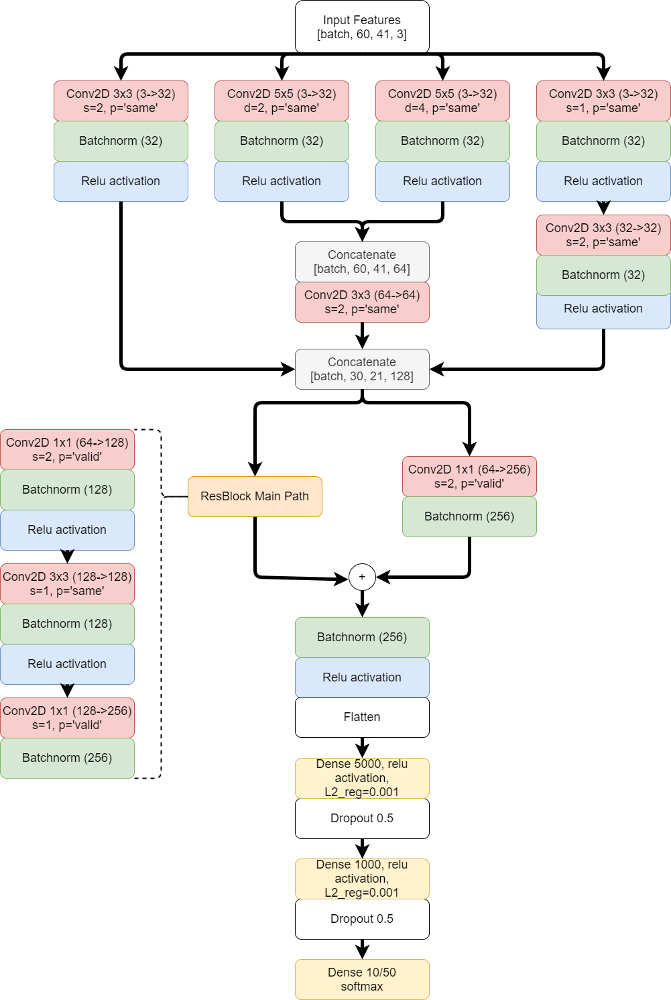
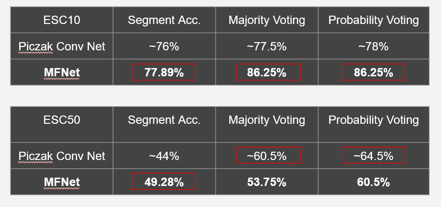
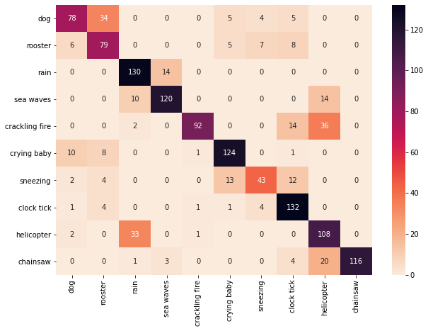
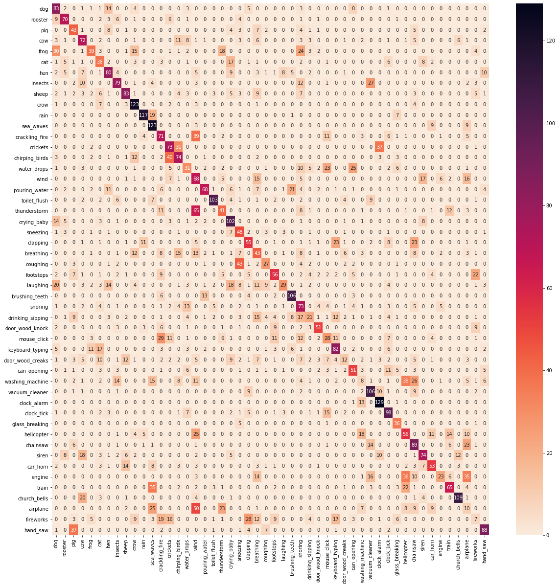

# EnvironmentalSoundClassification
Implementation of a deep convolutional network for environmental sound classification task using ESC10 and ESC50 datasets.

The main dependencies of the project are:
- Python 3.7.9
- Tensorflow-gpu 2.3.0
- cudatoolkit 10.1.243
- cudnn 7.6.5
- Librosa 0.8.0

# Model Structure
We firstly tried different architecture from the references with slight changes.
In the end the final model, Multi Feature Network - MFNet,  was inspired mainly by [1], inception and residual blocks.
The final performance is very similar to [1] being basically a derivation.

# Results

## Authors
- [Aniello Xie](https://github.com/Kraing)
- [Carlo Facchin](https://github.com/MrSeltz)

# References
[1] Karol J Piczak. Environmental sound classification with
convolutional neural networks. In 2015 IEEE 25th International Workshop on Machine Learning for Signal
Processing (MLSP), pages 1–6. IEEE, 2015.
[2] Shaobo Li, Yong Yao, Jie Hu, Guokai Liu, Xuemei Yao, 
and Jianjun Hu. An ensemble stacked convolutional neural
network model for environmental event sound recognition.
Applied Sciences, 8(7):1152, 2018.

[3] Andrey Guzhov, Federico Raue, Jorn Hees, and An- ¨
dreas Dengel. Esresnet: Environmental sound classification based on visual domain models. arXiv preprint
arXiv:2004.07301, 2020.

[4] Justin Salamon and Juan Pablo Bello. Deep convolutional
neural networks and data augmentation for environmental
sound classification. IEEE Signal Processing Letters,
24(3):279–283, 2017.

[5] Rene Schuster, Oliver Wasenmuller, Christian Unger, and ´
Didier Stricker. Sdc-stacked dilated convolution: A unified
descriptor network for dense matching tasks. In Proceedings of the IEEE/CVF Conference on Computer Vision and
Pattern Recognition, pages 2556–2565, 2019.

[6] Yuji Tokozume and Tatsuya Harada. Learning environmental sounds with end-to-end convolutional neural
network. In 2017 IEEE International Conference on
Acoustics, Speech and Signal Processing (ICASSP), pages
2721–2725. IEEE, 2017.

[7] Zhichao Zhang, Shugong Xu, Shan Cao, and Shunqing
Zhang. Deep convolutional neural network with mixup for
environmental sound classification. In Chinese conference
on pattern recognition and computer vision (prcv), pages
356–367. Springer, 2018.
